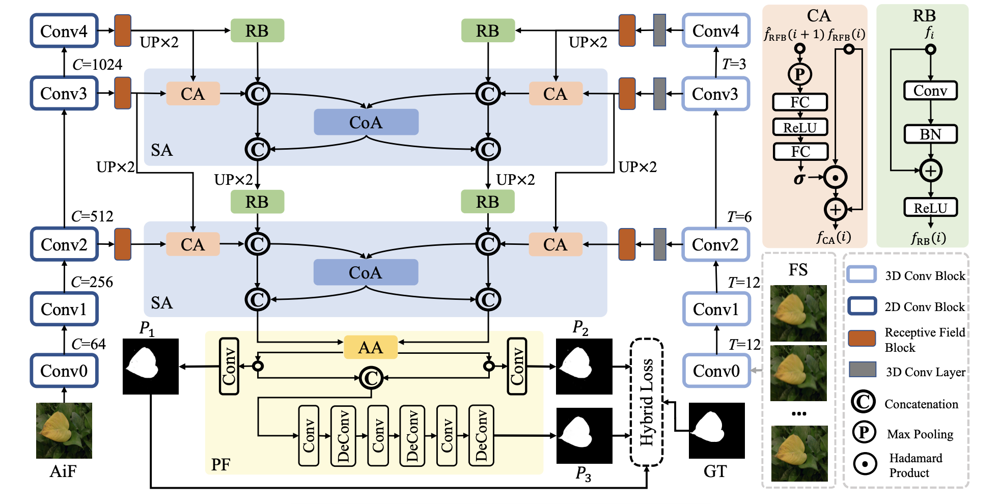
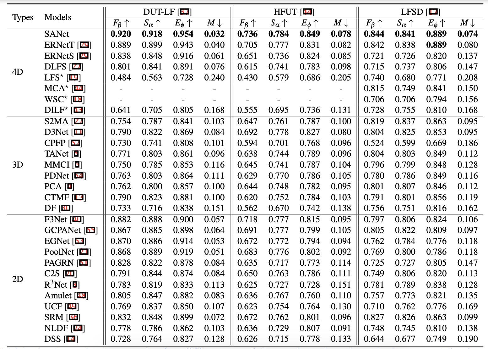
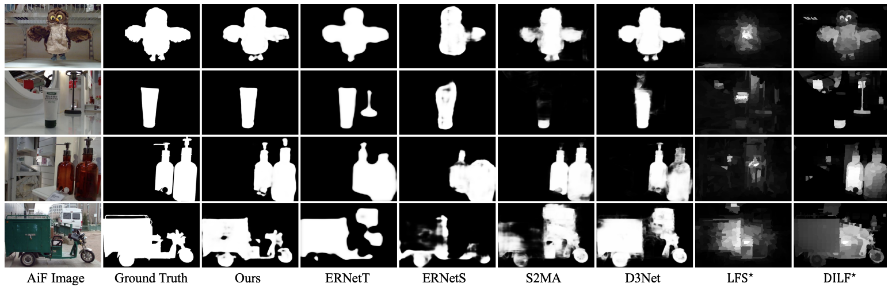

# [Learning Synergistic Attention for Light Field Salient Object Detection (BMVC 2021)](https://arxiv.org/abs/2104.13916)

Authors: [*Yi Zhang*](https://scholar.google.com/citations?user=NeHBHVUAAAAJ&hl=en), [*Geng Chen*](https://scholar.google.com/citations?user=sJGCnjsAAAAJ&hl=en), [*Qian Chen*](https://scholar.google.com/citations?user=Wz0lfcwAAAAJ&hl=en), [*YuJia Sun*](https://github.com/thograce), [*Yong Xia*](https://scholar.google.com/citations?user=Usw1jeMAAAAJ&hl=en), [*Olivier Deforges*](https://scholar.google.com/citations?user=c5DiiBUAAAAJ&hl=en), [*Wassim Hamidouche*](https://scholar.google.com/citations?user=ywBnUIAAAAAJ&hl=en), [*Lu Zhang*](https://luzhang.perso.insa-rennes.fr/)

# Introduction

      
    <em> 
    Figure 1: An overview of our SA-Net. Multi-modal multi-level features extracted from our multi-modal encoder are fed to two cascaded synergistic attention (SA) modules followed by a progressive fusion (PF) module. The short names in the figure are detailed as follows: CoA = co-attention component. CA = channel attention component. AA = AiF-induced attention component. RB = residual block. Pn = the nth saliency prediction. (De)Conv = (de-)convolutional layer. BN = batch normalization layer. FC = fully connected layer.
    </em>

In this work, we propose Synergistic Attention Network (SA-Net) to address the light field salient object detection by establishing a synergistic effect between multimodal features with advanced attention mechanisms. Our SA-Net exploits the rich information of focal stacks via 3D convolutional neural networks, decodes the high-level features of multi-modal light field data with two cascaded synergistic attention modules, and predicts the saliency map using an effective feature fusion module in a progressive manner. Extensive experiments on three widely-used benchmark datasets show that our SA-Net outperforms 28 state-of-the-art models, sufficiently demonstrating its effectiveness and superiority.

:running: :running: :running: ***KEEP UPDATING***.

# Main Results

      
    <em> 
    Figure 2: Quantitative results for different models on three benchmark datasets. The best scores are in boldface. We train and test our SA-Net with the settings that are consistent with ERNet, which is the state-of-the-art model at present. - denotes no available result. ↑ indicates the higher the score the better, and vice versa for ↓.
    </em>

      
    <em> 
    Figure 3: Qualitative comparison between our SA-Net and state-of-the-art light field SOD models.
    </em>

# Predictions

Download the saliency prediction maps at [Google Drive](https://drive.google.com/file/d/1dTrTO7FcQbWC00YEqGS7NP44YQ27Q4Yk/view?usp=sharing) or [OneDruve](https://1drv.ms/u/s!Ais1kZo7RR7Li3PTJptdtlkvIZo4?e=OKjdhX).

# Inference

Download the pretrained model at [Google Drive](https://drive.google.com/file/d/1d2ZJAgCGRq0TNC8oVWHy-_AZIV31ykef/view?usp=sharing) or [OneDrive](https://1drv.ms/u/s!Ais1kZo7RR7Li3SjH6Si_gn2XrSd?e=Yf0oNp).

# Training

Please refer to [SANet_train.py]().

